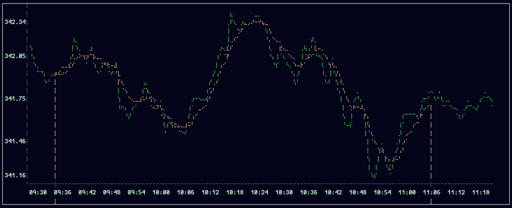
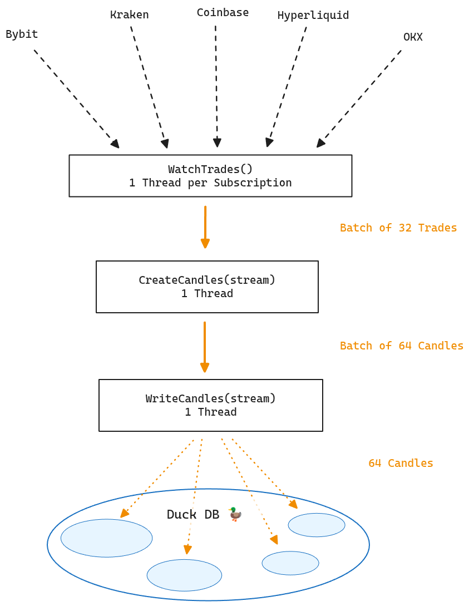
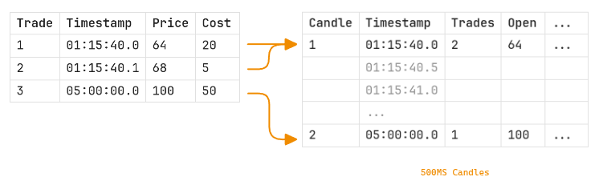

Aggregate candles for 108 exchanges at sub-second precision with [CCXT](https://github.com/ccxt/ccxt) and [DuckDB](https://duckdb.org/).



# Table of Contents
- [Quick Start](#quick-start)
- [Reading Market Data](#read-market-data)
- [Architecture](#Architecture)
- [Contact](#Contact)

# Quick Start

### Prerequisites

1. **Download the executable**  
   Get the [market-data](https://github.com/10-24/Market-Data/releases/latest) executable and place it in your project folder.

2. **Install DuckDB CLI**

   **Linux & MacOS:**
   ```bash
   curl https://install.duckdb.org | sh
   ```

   **Windows:** [Download here](https://duckdb.org/install/?platform=windows&environment=cli).

### Step 1: Set Up the Database

Initialize a new database (can be placed anywhere):

```bash
duckdb ./database.duckdb
```

Once connected, create the required tables:

```sql
CREATE TABLE data_subscription (
    exchange_id    VARCHAR,
    base           VARCHAR,
    quote          VARCHAR,
    UNIQUE(base, quote, exchange_id)
);

CREATE TABLE data_catalog (
    table_name     VARCHAR, 
    base           VARCHAR, 
    quote          VARCHAR, 
    exchange_id    VARCHAR, 
    created_at     TIMESTAMP, 
    UNIQUE(base, quote, exchange_id)
);
```

### Step 2: Add Subscriptions

Add the trading pairs you want to track:

```sql
INSERT INTO data_subscription VALUES ('kraken','BTC','USD');
INSERT INTO data_subscription VALUES ('coinbase','SOL','USD');
INSERT INTO data_subscription VALUES ('bybit','SUI','USDT');
```

> **Note:** See [CCXT](https://github.com/ccxt/ccxt?tab=readme-ov-file#supported-cryptocurrency-exchanges) for the full list of supported exchange IDs. Each subscription uses approximately 0.9 MB/day after compression.

Disconnect from the database when done:

```sql
.quit
```

### Step 3: Add the Configure

Create a `project/config/config.toml` file:

```toml
# config.toml
db_path = "./database.duckdb"  # or your custom path

# Optional: Adjust batch sizes if needed
[settings.watch_trades]
batch_size = 32
batch_buffer_size = 32

[settings.create_candles]
batch_size = 64
batch_buffer_size = 16
```

### Step 4: Run the Application 🔥

```bash
./market-data
```

That's it. Candles will be aggregated at 500ms intervals. [Read More](#Candle)


# Read Market Data 
## SQL

To read market data while pipeline is running 

```bash
duckdb ./database.duckdb -readonly
```

To see all the market data tables run:

```sql
SELECT * FROM data_catalog;
```

Then view the data from one of the tables.

```sql
SELECT * FROM <table_name> -- ex: 'SELECT * FROM btcusd_kraken_candles'
```

## Python

```python
import duckdb

conn = duckdb.connect(database='path/to/database.duckdb', read_only=True)
df = conn.sql("SELECT * FROM linkusd_okx_candles").pl()

df = hydrate_candles(df)
```


```python
import polars as pl

def hydrate_candles(df:pl.DataFrame) -> pl.DataFrame:
	""" Fills omitted entries from previous close and interpolates `vwap` """
	
	return (
	  df
		.upsample(time_column="timestamp", every="500ms")
		.with_columns(
			pl.col("close").forward_fill(),
			open = pl.col("open").fill_null(pl.col("close").shift(1)),
			high = pl.col("high").fill_null(pl.col("open")),
			low = pl.col("low").fill_null(pl.col("open")),
			vwap = pl.col("vwap").interpolate(),
			volume = pl.col("volume").fill_null(0.0),
			trade_count = pl.col("trade_count").fill_null(0),
		)
	)
```

# Architecture

Each module pushes its output (trade, candle) to a batch. Once the batch is full, it's flushed to a channel which feeds into the next module.



## Candle

The base duration is $500 \text{ms}$. However, any duration that is a multiple of $500\text{ms}$ can be derived.

| Attribute   | Data Type (SQL) | Data Type (Polars) |
| ----------- | --------------- | ------------------ |
| timestamp   | TIMESTAMP       | DateTime           |
| open        | FLOAT           | Float32            |
| high        | FLOAT           | Float32            |
| low         | FLOAT           | Float32            |
| close       | FLOAT           | Float32            |
| volume      | FLOAT           | Float32            |
| vwap        | FLOAT           | Float32            |
| trade_count | UINTEGER        | UInt32             |

Clearly I've compromised precison using floating point numbers. However, if a model is effected by an error that is 1/3 of 1% of 1% — its likely overfitting. This is precise enough for statistical models.

$$
 \frac{5}{10^{7.22}} \times 100 =  \frac{1}{20,000} \times \frac{1}{10^{0.22}} \approx 0.003013\% 
$$

([f32 Precision](https://en.wikipedia.org/wiki/Single-precision_floating-point_format))

### Lazy Emission

Instead of emmiting after a preset duration, a candle is emitted only after a late trade pushes a new candle in its place. 



Similar to the batching behavior described above, this approach maximizes throughput at the cost of freshness.

### Dropped Trades

Occasionally, you'll see a log:

```bash
Warning: Dropped Trade for BASE/QUOTE@exchange
```

This indicates a trade couldn't be added to a candle because it before the interval started. Particular exchanges, like `MEXC`, have stronger tendencies to drop trades.

---
## Contact
If you have any questions, my email is RYAN@01024.xyz 🙌

[^1]: Creating `./config/markets/` allows you to bypass particular reigon blocks 🦅🦅, but its not described in this guide.
t